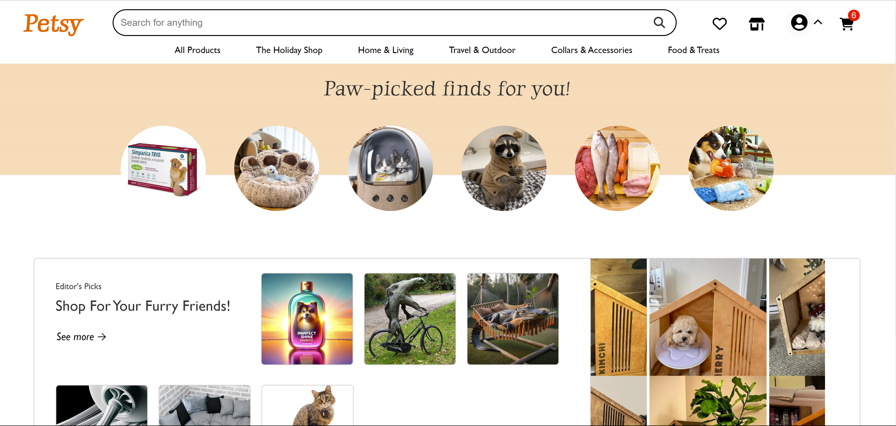
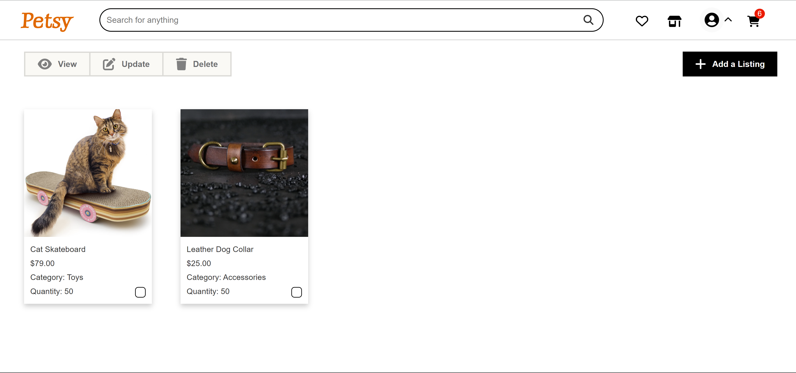
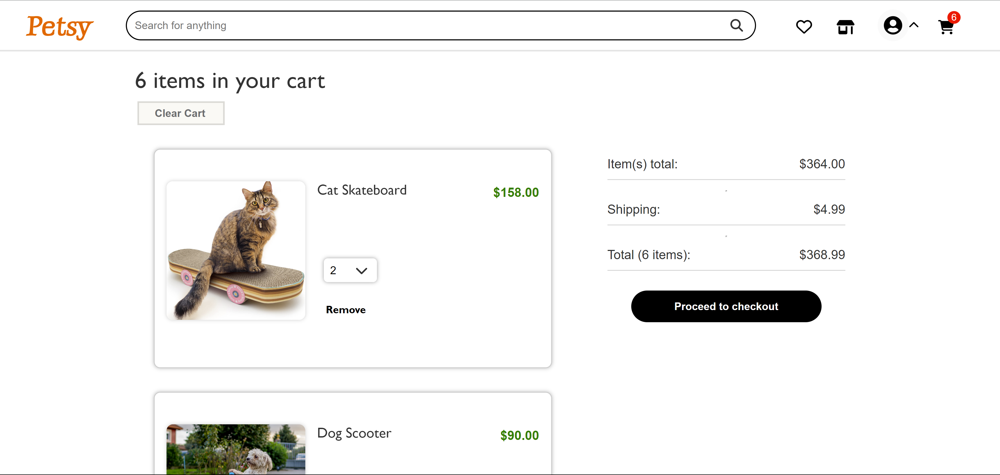

# Petsy

Petsy is is a Flask - React fullstack clone of Etsy, the ecommerce website. It was built to act as a marketplace where animals could buy and sell products they make to each other.

## Live Site

- **Open Petsy:** [Petsy](https://petsy-5c0d.onrender.com)

## Technologies Used

### Frontend
- Javascript
- React
- Redux

### Backend
- PostgreSQL
- Python
- Flask
- SQLAlchemy

## To Get Started

1. Clone this repository (only this branch)

2. Install dependencies

      ```bash
      pipenv install -r requirements.txt
      ```

3. Create a **.env** file based on the example with proper settings for your
   development environment

4. Setup your PostgreSQL credentials and database according to the variables set in .env.

5. This starter organizes all tables inside the `flask_schema` schema, defined
   by the `SCHEMA` environment variable.  Replace the value for
   `SCHEMA` with a unique name, **making sure you use the snake_case
   convention**.

6. Get into your pipenv, migrate your database, seed your database, and run your Flask app

   ```bash
   pipenv shell
   ```

   ```bash
   flask db upgrade
   ```

   ```bash
   flask seed all
   ```

   ```bash
   flask run
   ```

7. To run the React App in development, checkout the [README](./react-app/README.md) inside the `react-app` directory.

8. The application will now be running at [http://localhost:3000/](http://localhost:3000/).


## Functionality & MVPs

In **Petsy**, users can:

- **Authenticate:**
  - Sign up, log in, use a Demo User feature, and log out.

- **Products:**
  - View, create, edit, and delete products and product listings. A search and organization features have also been implemented.

- **Reviews:**
  - View, add, edit, and delete reviews for products that the authenticated user purchased.

- **Shoppping Cart:**
  - View all products added to cart, as well as add more products, remove products, and edit quantity in the cart. Transactions can be successfully completed.

- **Favorites:**
  - View list of favorites, and add and delete product favorites from list.


## Implementation Highlights

### Splash Page


### Favorites Page


### Listings Page


### Shopping Cart



## Future Features

This site is still being updated and completed. Future features will include:
- Stripe payment API
- More comprehensive listing management page
